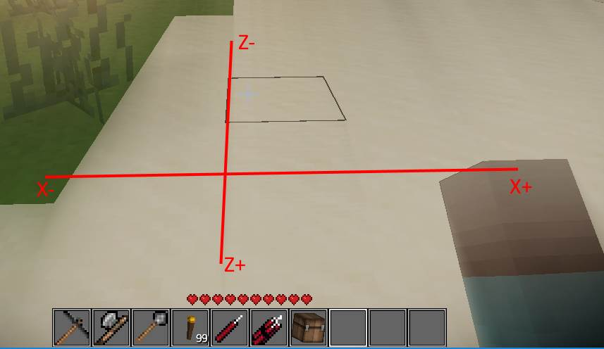
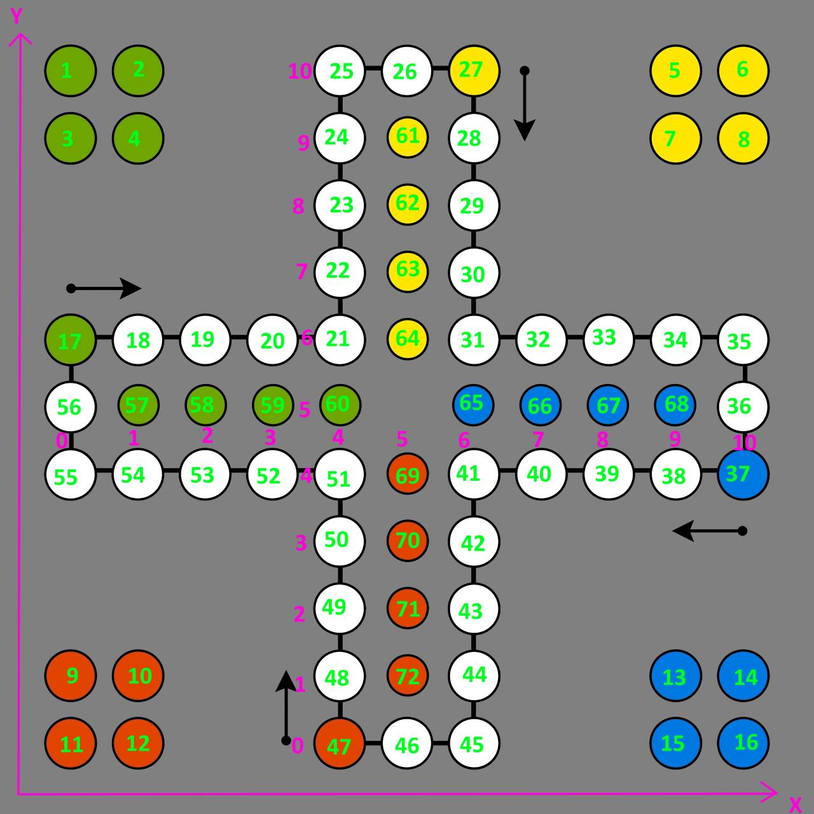

# Oniatus Small Games

This module for Terasology aims to provide a lobby where players can select small games to play. 
The module should create an instance of the game and let one player play against ai or multiple players play
against each other.

Therefore the goals from a game perspective are:
1. Provide an ingame lobby
2. Multiplayer capable
3. Singleplayer capable (ai for all games)
4. Every release must be playable

Besides that the module will be developed as techdemo and development example for Terasology.
Goals from the developer guide example are:
1. Maintain release notes
2. Document line of thought and architecture decisions in a devlog
3. Document features for possible extraction and re-use

All textual documentation is maintained in this single document.

* [Release Notes](#Release Notes)
* [Features](#Features)
* [Devlog](#Devlog)

# Release Notes

# Features

# Devlog

## 0.0.1

### Spawning the game board ingame
To transfer the game coordinates to Terasology coordinates and then spawn blocks for the
game positions, we should first have a look at the Terasology coordinate system.

Standing on the x-axis, the z-axis will decreases instead of increasing like our own y-axis.
So our board x-axis can directly be transferred to Terasology but the y-axis has to be multiplied by -1.
To have more control over the board spawning, the logic will be triggered by an event which can then be used in a 
debug command or later on in the actual logic. To test the correct wiring from the event to a spawn of blocks,
the module tests will be used.

### First backend game logic
The game logic of "Mensch ärgere dich nicht" is an interesting programming exercise because of the different pathing
for each color at their house and because of the special move logic, e.g. pieces are not allowed
to move on positions with a piece of the same color but may capture pieces of different colors.
To model the positions, a single position was used for each field to decouple the game from 2d or 3d representations.
This logic can be wrapped in a 2d-facade at a second step.
The initial concept of the board looks like this

Green numbers represent the indices, purple numbers the 2d-coordinates.
The logic is also a good exercise for test driven development.
A video of the implementation for the indices and game logic is [available at YouTube](https://youtu.be/iNGY-hZ_aR4) 
in case someone is interested of the process between commits.

### World generation and module testing
The world generator has to create a world which fits the purpose of a game lobby.
The area should not be too big an visible from all places. The first attempt will be a glass
floor with a border on the sides. Terasology has a glass block in core but the module should not include Core as
dependency. Therefore a copy of the glass block will be included in this module.

The first game in this module will be the german board game [Mensch ärgere Dich nicht](https://en.wikipedia.org/wiki/Mensch_%C3%A4rgere_dich_nicht).
As the lobby should be able to handle multiple games and players should be able to view running games through a glass floor, 
the initial size of the lobby should be able to handle 2x2 games at once.
One game board has a size in tiles of 11 by 11, taking 2 extra tiles as reserve means the lobby should have a side-length
of around 26. We round this up to 30 and start with borders at the +-30 axis.